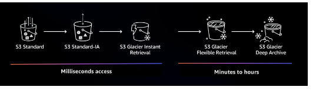
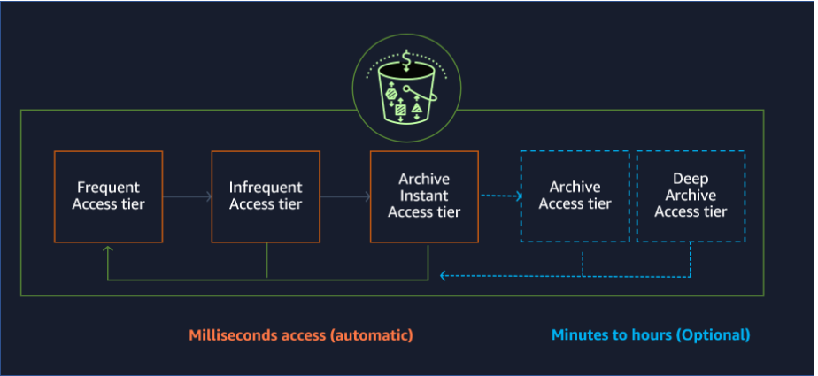
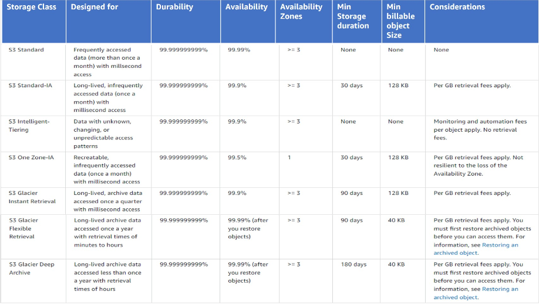

#### Data organization prefixes and tags

Using S3 object tags allow you to add up to 10 key value-pair.
Can apply tag to bucket, object, or both.

Determine the access pattern, usage,storage requirementes,SLAS, and
durability.

Storage class analysis provides storage usage visualizations in 
the Amazon S3 console that are updated daily. 

#### Amazon S3 inventory reports

To keep track of objects and their respective tags, buckets, and prefixes,
you can use an S3 inventory report that lists your stored objects
within an S3 bucket or with a specific prefix, and their respective 
metadata and encryption status. S3 inventory can be configured to 
generate reports on a daily or a weekly basis.

#### Amazon S3 Infrequent Access

Minimum storage duration is 30 days.
Mininum size is 128KB.

Availibility 99.9 %

#### Amazon S3 One Zone Infrequent Access

Availability 99.5 %
20% less than S3 IA

This storage class is a good choice for storing secondary 
backup copies of on-premises data, data you can easily
recreate, or storage you have already replicated in another A
WS Region using S3 cross-Region replication for compliance or 
disaster recovery purposes.

#### Amazon S3 Intelligent-Tiring

3 Tiers: frequent access, infrequent access, archive instant access

Object have not been accessed in 30 consecutive days, goes to IA
Object have not been accessed in 90 consecutive days, goes to archive
After 180 days, goes to Deep Archive 

How do I identify in which tier my objects are located?
–
*You can use Amazon S3 Inventory to report the access tier of objects stored in the
S3 Intelligent-Tiering storage class. Amazon S3 Inventory provides
CSV, ORC, or Parquet output files that list your objects and their
corresponding metadata on a daily or weekly basis for an S3 bucket 
or a shared prefix. You can also make a HEAD request on your objects 
to report the S3 Intelligent-Tiering archive access tiers. 

#### S3 Glacier Instant Retrieval

minimum storage is 90 days
Billable object size is 128KB
Millisecond retrieval time

#### S3 Glacier Flexible Retrieval

Minimum storage is 90 days
Minutes to 12 hours to retrieve
Billable object 40KB

Expedited: 1-5 minutes
Standard: 3-5 hours
Bulk: 5-12 hours

#### S3 Glacier Deep Archive

Minimum storage is 180 days
Billable object size is 40KB
Standard: 12 hours
Bulk: 48 hours

|Storage Class | Use Case | Amount stored | Price      |
|---|---|---|------------|
| S3 Glacier Instant Retrieval | Fon longed-lived archive data accessed once a quarte with instant retrrieval in milliconds | Total amount of storage/month | 0.0004 GB  |
| S3 Glacier Flexible Retrieval | For long-lived archive data accessed once a quarter with retrieval time of minutes to 12 hours | Total amount of storage/month | 0.0036 GB |
| S3 Glacier Deep Archive | For long-lived archive data accessed once a quarter with retrieval time of 12 hours to 48 hours | Total amount of storage/month | 0.0.00099 GB |

