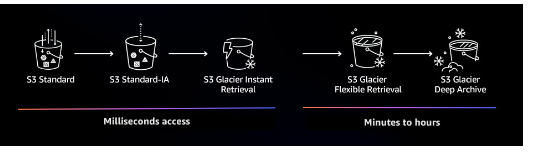

#### Data organization prefixes and tags

Using S3 object tags allow you to add up to 10 key value-pair.
Can apply tag to bucket, object, or both.

Determine the access pattern, usage,storage requirementes,SLAS, and
durability.

Storage class analysis provides storage usage visualizations in 
the Amazon S3 console that are updated daily. 

#### Amazon S3 inventory reports

To keep track of objects and their respective tags, buckets, and prefixes,
you can use an S3 inventory report that lists your stored objects
within an S3 bucket or with a specific prefix, and their respective 
metadata and encryption status. S3 inventory can be configured to 
generate reports on a daily or a weekly basis.

#### Amazon S3 Infrequent Access

Minimum storage duration is 30 days.
Mininum size is 128KB.

