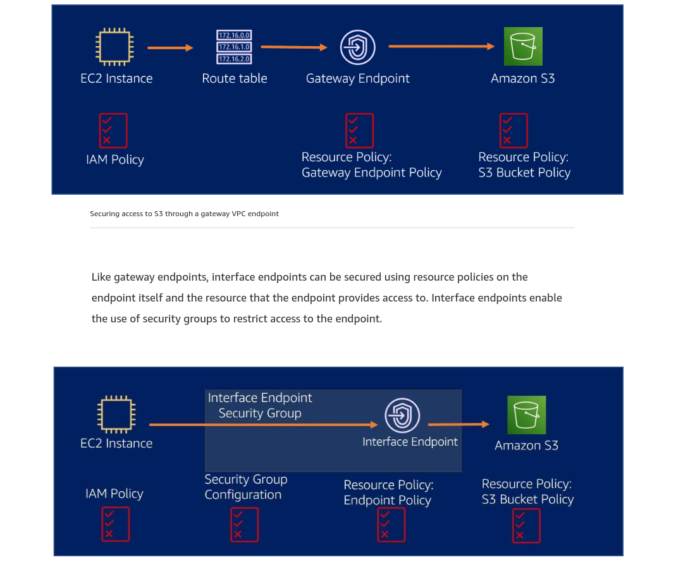

#### Gaining insight with CloudWatch

#### Cloudwatch metrics key elemens

 - Metrics

Metrics are the fundamental concept in Cloudwatch. A metric represents
a time-ordered set of data points that are published to Cloudwatch.

 - Dimensions

Dimensions are name/value pairs that are part of the identity of a metric.

 - Filters

When working with Cloudwatch metrics, you have the option of filtering
the data into groups o related objects within a single bucket.

- Dashboards

Dashboards are a collection of graphs that you can use to monitor your AWS resources.

#### Cost Optimization

- Application Requirements

- Data organization

- Understand,analyze and optimize

- Continous right sizing

### Tools for S3

- Amazon S3 Inventory

You can use it to audit and report on the replication and encryption
status of your objects for business, compliance, and regulatory needs.

- Amazon S3 Server Access Logs

Provides detailed records for the requests that are made to a bucket.

- AWS CloudTrail logs
Is a service that enables governance, compliance, operational auditing, and risk
auditing of your AWS account.

S3 Inventory is used to determine which objects are in your buckets. Server Access Logs 
and CloudTrail logs help you to determine which of these objects are being accessed and how 
frequently they are accessed.  Using these tools together allows you to determine if objects 
are being put to S3, but never accessed. Once that determination is made, objects that are never
accessed can be moved to archived tiers for storage cost savings.
- 

Amazon QuickSight

Allows you to visualize S3 data by allowing you to create
and publish interactive business intelligence dashboards.

- S3 Storage Lens

Delivers organizational wide visibility into object storage usage,
activity trends and make actionable recommendations to optimize costs.

- S3 Storage class Analysis

This tool allows you to monitor access patterns across objects
to help you decide when to transition data to the right storage

- AWS Budget

Allows you to set custom budgets to track your cost and usage.

- AWS Cost Explorer

Provides botha billing and usage report.

#### S3 Storage Lens

Provides a single view of object storage and activity across hundreds of
acconts

Produces actionable recommnedations to help improve cost-efficiency and apply
data protection best practices

#### AWS Budgets

Monthly fixed target

Monthly variable target budget

Fixed usage amount

Daily utilization budget

Best Practices

- Use AWS Budget to set custom budgets based on your costs, usage,reservation
utilization, and RI coverage.

- Set budgets on a recurring basis so that budget alerts don't unexpectedly
stop coming.

- AWS requires approximately five weeks of usage data to generate 
 budget forecasts. If you set a budget to alert based on a 
 forecasted amount, this budget alert isn't initiated until 
you have enough historical usage information.

#### Access Point

Provide simplified control for shared dataset in the same bucket.
Each access point has its own access permissions

### Protecting Sensitive Data Using encryption

- SSE-S3

When you use Server-Side Encryption with Amazon S3-Managed Keys (SSE-S3), each object encrypts with a unique key, which is then encrypted with a primary key. Amazon S3 manages the keys and automatically rotates them. Amazon S3 server-side encryption uses one of the strongest block ciphers available, 256-bit Advanced Encryption Standard (AES-256), to encrypt your data

- SSE-KMS

A customer master key (CMK) is a logical representation of a master key. The CMK includes metadata, such as the key ID, creation date, description, and key state. The CMK also contains the key material used to encrypt and decrypt data. You can choose a customer managed CMK that you create and manage, or you can choose an AWS managed CMK that Amazon S3 creates in your AWS account and manages for you. Like a customer managed CMK, your AWS managed CMK is unique to your AWS account and Region. Only Amazon S3 has permission to use this CMK on your behalf.  

Benefits of using SSE-KMS

You manage the rotation of the keys 
Easier to manage a few primary keys as opposed to billions of data keys
Centralized access and auditing

Performs better for large datasets

- SSE-C

With Server-Side Encryption with Customer-Provided Keys (SSE-C), you manage the encryption keys. Amazon S3 manages the encryption, as it writes to disks, and decryption, when you access your objects. With this option, you are responsible for managing and rotating the keys. Amazon S3 data can be decrypted only with these keys. This means that if you lose your keys, even AWS Support cannot help you gain access to your data.

If you are using a custom AWS KMS key, you must grant users access to use the key. Otherwise, they will not be able to decrypt the objects. In addition, the default encryption on the bucket is used on all objects unless the object PUT request header contains a different encryption method. If the header specifies an encryption method other than the default encryption, it uses the encryption method specified in the header when the object is written to the bucket. You can track default encryption configuration requests for Amazon S3 buckets by doing one of the following:

Using AWS CloudTrail events
Creating Amazon CloudWatch Events with S3 bucket-level operations as the event type 

#### Gateway Endpoint

Support both Amazon S3 and DynamoDb are specified in your route table and use the route prefix to direct traffic destined for S3 or Dynamodb to the gateway endpoint

Using a gateway endpoint provides a way to access S3 bucket without your data transversing the internet.This keeps private subnets secure because you do not have to add
an internet gateway.

- Benefits

Reduce data transfer charges resulting from outbound and netwrok commnication between VPC and services that requiere public AWS services, such as S3.

Security in depth using IAM, Gateway Endpoint and S3 bucket policies.

Compliance and regulatory adherenca as data does not leave the Amazon Network.

#### Interface Endpoint

Is an elastic network interface with a private IP address from the IP address range of your subnet. It servers as an entry point for traffic destined to supported AWS services
or to A vpc Endpoint

- Benefits

Reduce data transfer charges resulting from outbound network communication between VPC and services that require public AWS services

Security and easy access control using VPC endpoint policies

Applications in an Amazon VPC can securely access AWS PrivateLink endpoints across AWS Regions using inter-Region VPC peering 

Simplifies on-premises network and firewall configuration for S3 access. No longer requires public IPs or an internet gateway

Reduce the need to build self-managed proxy servers with private IPs for S3 access from on-premises applications

| | Gateway Endpoint | Interface Endpoint | 
|-| ---------------- | ------------------ |
|Security | Uses endpoint policies for security | Uses endpoint policies and security groups| 
|Amazon network Connectivity | Uses Amazon netwrok to connect to S3 and dynamoDB | Uses Amazon Network throh AWS Private Link to connect to AWS Services|
|Access outside of the VPC| Not accessible from outside the VPC | Can be accessed from on-premises and accross Regions | 
|IP connectivyt | Uses the public IPs fo S3 and modifies the route table | Uses private IPS and can use public or endpoint-specific DNS Names |
|Cost | No additional charge for using gateway endpoints | Charges a fee|

